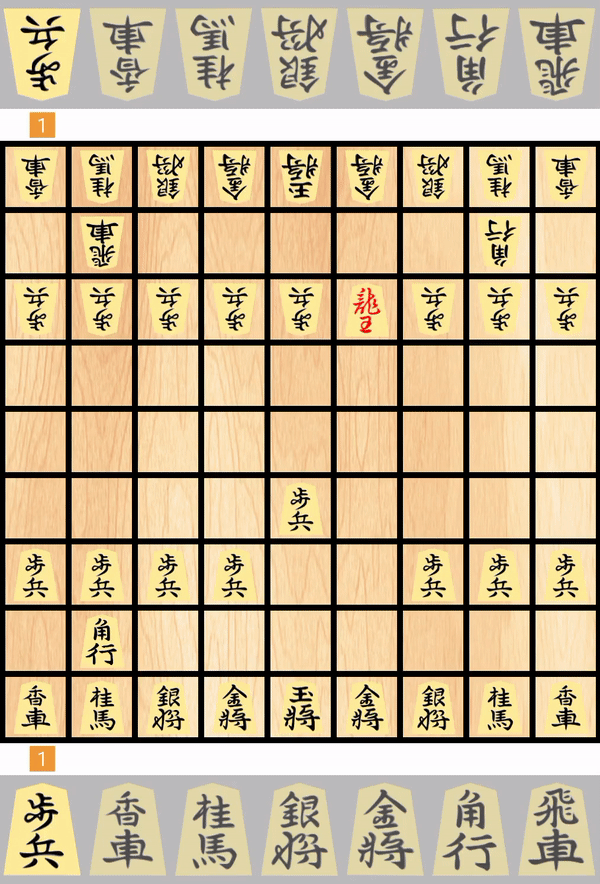
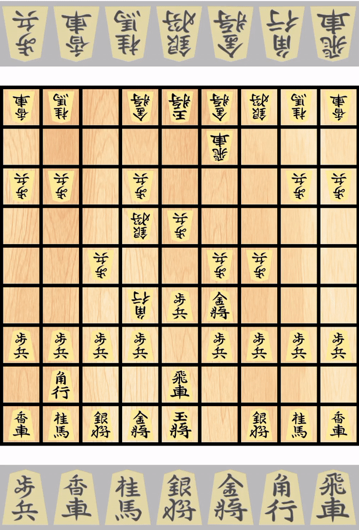
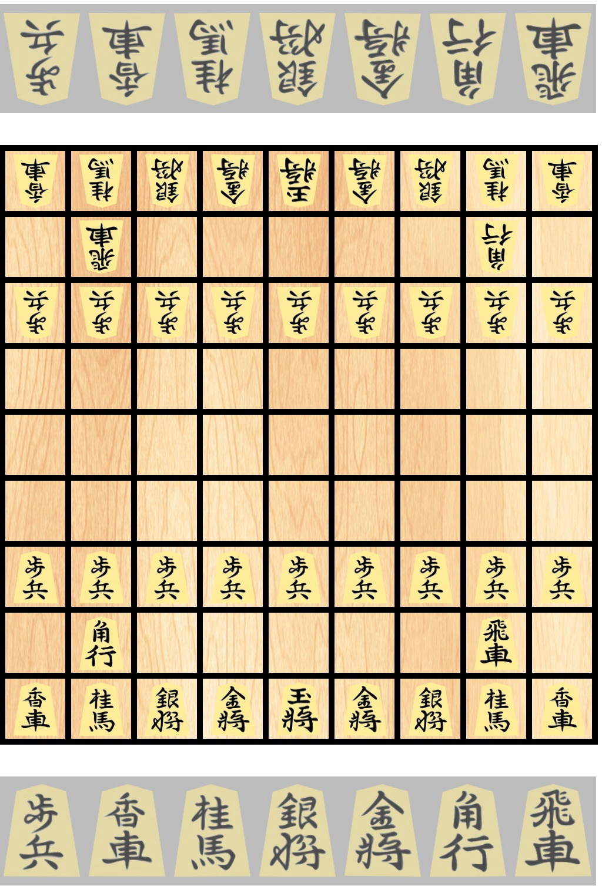
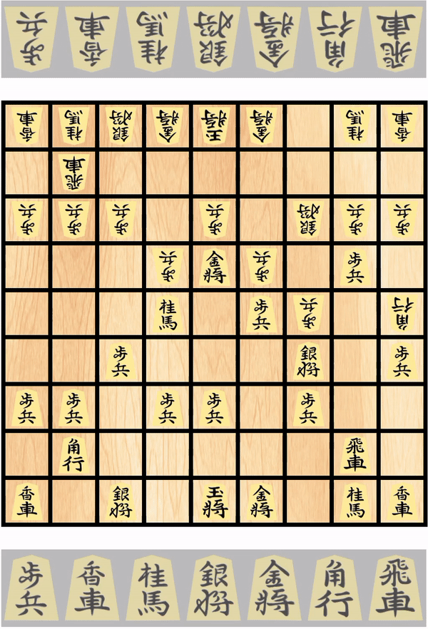
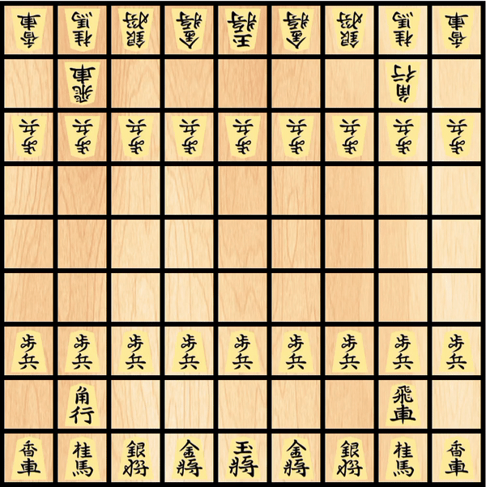
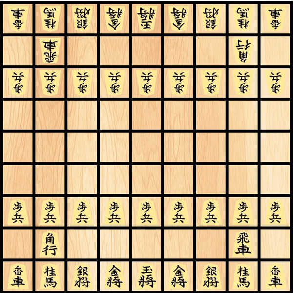
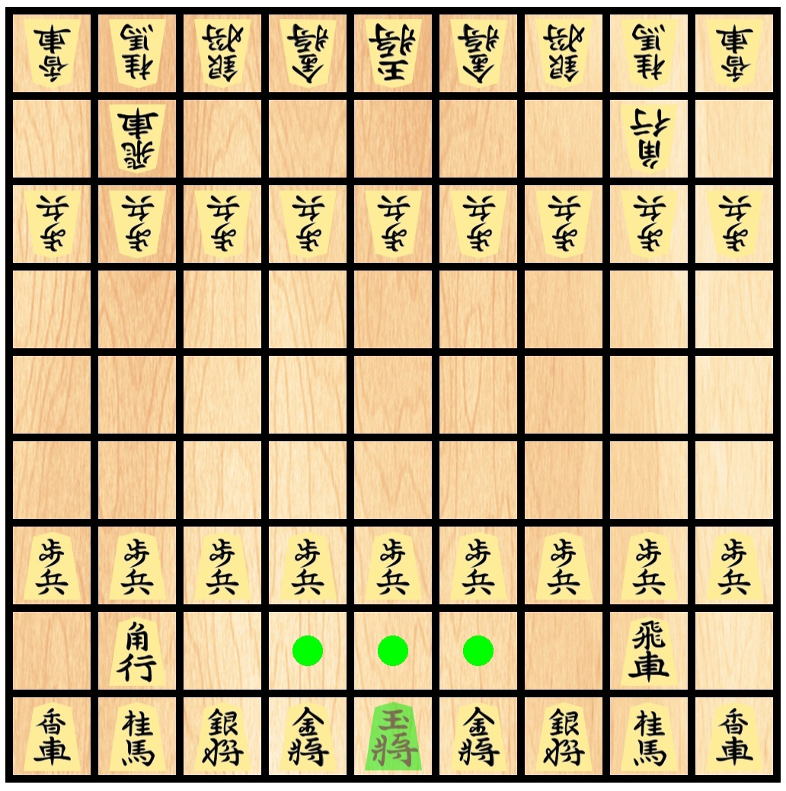
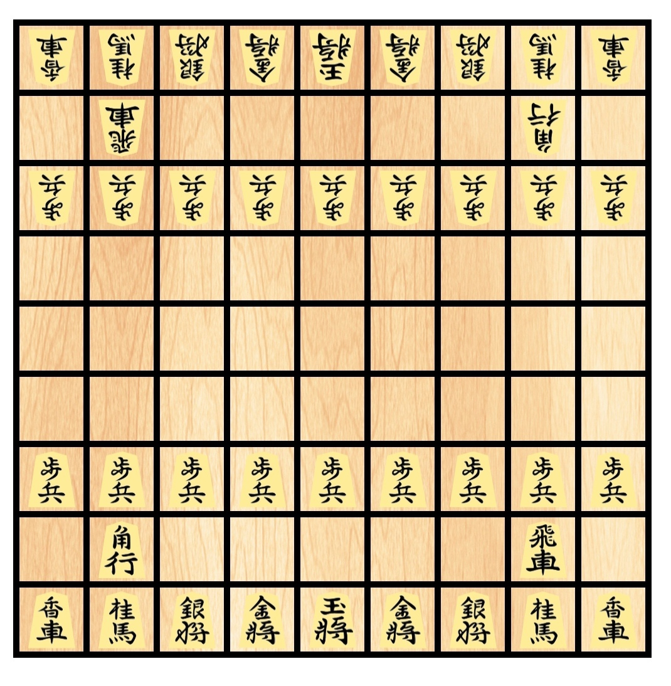

# Shogi Android Application 
## My little developer diary

### 03.02.2022
#### Added menu  

#### Added multiplayer  

### 02.02.2022
#### Added AMAZING ULTRA SUPER MEGA MUSIC THEME by [ilbond](https://github.com/ilbond)
#### Added promoting of pieces  

### 01.02.2022
#### Added counting of eaten pieces  

### 31.01.2022
#### Added bundle for eaten pieces

#### Added collection of eaten figures to the bundle

### 30.12.2021
#### Added eating of pieces  

### 24.12.2021
#### Added moving of pieces by rules  

### 23.12.2021
####  Selection of pieces works

### 21.12.2021 
####  Done drawing board and all pieces scaled by screen size.

